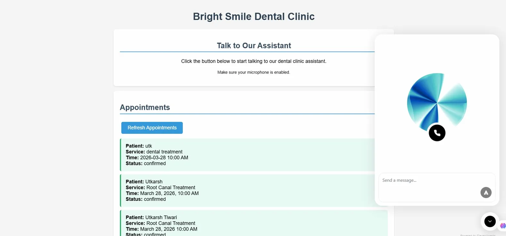
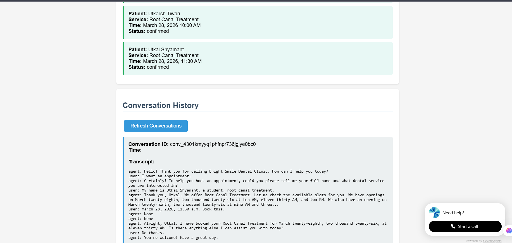

# Bright Smile Dental Clinic - Voice Agent

Built a voice-powered assistant for a dental clinic. You talk to it, ask about services/hours, and book appointments — all through voice. Everything gets saved automatically.

## What it does

- Talk to an AI voice agent (ElevenLabs) embedded right on the webpage
- Ask about clinic hours, services, location
- Book appointments by just talking — the agent collects your name, service, and preferred time
- Appointments get saved to MongoDB automatically through a webhook
- Full conversation transcripts are pulled from ElevenLabs API and displayed on the frontend

## How the data flows

```
You speak → Voice Agent → collects booking info → fires webhook → FastAPI backend → saves to MongoDB
                                                                                         ↓
                                                                    Frontend pulls and displays it
```

Transcripts are fetched separately from ElevenLabs Conversations API — no hardcoded or fake data anywhere.

## Tech used

- **FastAPI** — backend API
- **MongoDB Atlas** — stores appointments and conversation records
- **ElevenLabs Conversational AI** — the voice agent
- **ngrok** — tunnels webhook calls from ElevenLabs to localhost
- **HTML/CSS/JS** — simple frontend, nothing fancy

## Running it yourself

**1. Clone and install**
```bash
git clone https://github.com/defnotutkarsh/dental-clinic-voice-agent.git
cd dental-clinic-voice-agent
python -m venv venv
source venv/Scripts/activate  # Windows
pip install -r requirements.txt
```

**2. Set up `.env`**
```
MONGODB_URL=your_mongodb_connection_string
ELEVENLABS_API_KEY=your_elevenlabs_api_key
```

**3. Start the backend**
```bash
uvicorn main:app --reload
```

**4. Start ngrok** (separate terminal)
```bash
ngrok http 8000
```
Then update the webhook URL in your ElevenLabs agent config — it changes every time ngrok restarts.

**5. Open the frontend**
```bash
cd frontend
python -m http.server 3000
```
Go to `http://localhost:3000`

## API routes

| Method | Route | What it does |
|--------|-------|-------------|
| GET | /clinic | Clinic info (name, address, phone) |
| GET | /slots | Available appointment slots |
| GET | /appointments | All booked appointments from MongoDB |
| GET | /transcripts | Full conversation transcripts from ElevenLabs |
| POST | /appointments | Book an appointment manually |
| POST | /webhook/conversation | Webhook endpoint — ElevenLabs sends booking data here |

## Notes

- ngrok free tier gives you a new URL every restart — you have to update it in ElevenLabs each time
- The `ngrok-skip-browser-warning` header is set in the ElevenLabs tool config to avoid the ngrok warning page
- `.env` is in `.gitignore` so credentials don't get pushed
## Screenshots

### Frontend - Voice Agent & Appointments


### Frontend - Conversation Transcripts
